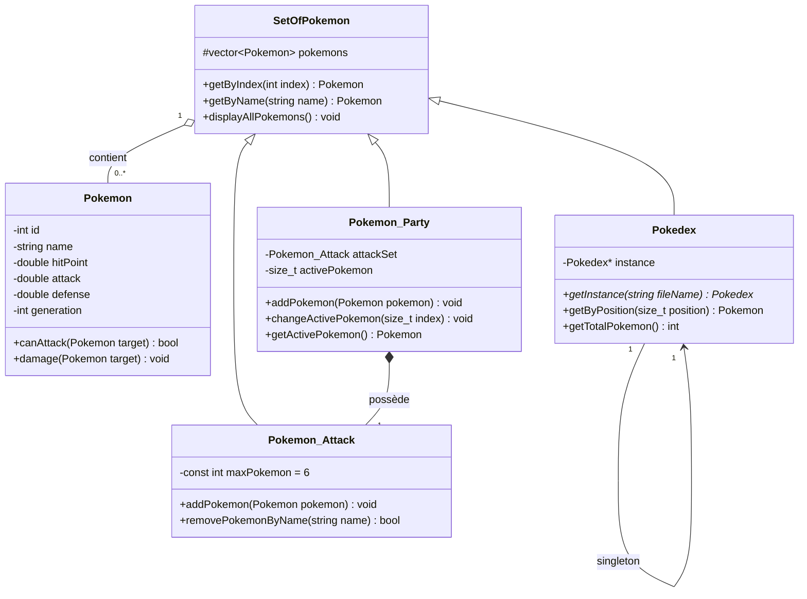

# TP Introduction en C++

Auteur : Lucas Raveloarinoro


## Introduction

Ce projet est une première introduction au langage C++. Il s'agit d'un jeu s'inspirant de Pokemon. Il a été réalisé en 18h et contient les premiers objets clés du jeu, pour une version simplifiée.

## Classes

- `Pokemon` : représente un Pokémon avec son id, son nom, ses points de vie, son attaque, sa défense et sa génération. Pour l'instant, on ne peut qu'attaquer.
- `SetOfPokemon` : classe abstraite qui stocke une collection de Pokémons et permet de les rechercher par id ou par nom.
- `Pokedex` : hérite de `SetOfPokemon`. Elle utilise le design pattern Singleton.
- `Pokemon_Party` : hérite de `SetOfPokemon` et représente l'ensemble des pokemons du joueur. Elle possède également un `Pokemon_Attack` pour les Pokémons actuellement en attaque.
- `Pokemon_Attack` : hérite de `SetOfPokemon` et représente l’ensemble des Pokémons placés en attaque, avec une limite de six Pokémons.

## Diagramme de classes



## Interface Graphique

Cette étape n'est qu'en développement pour l'instant, lors de l'execution, fermez la fenêtre pour voir le programme dans le CLI.

## Comment build le projet

Si vous cherchez à le build depuis le CLI, il faut être à la racine du projet, et avoir CMake et vcpkg installés. Il faut ensuite taper : 
```powershell
cmake -S . -B build `
  -DCMAKE_TOOLCHAIN_FILE="C:\path_to_vcpkg\vcpkg\scripts\buildsystems\vcpkg.cmake"```

Puis 
```cmake --build build --config Debug```

Et lancer le programme : 
```Pokemon.exe```