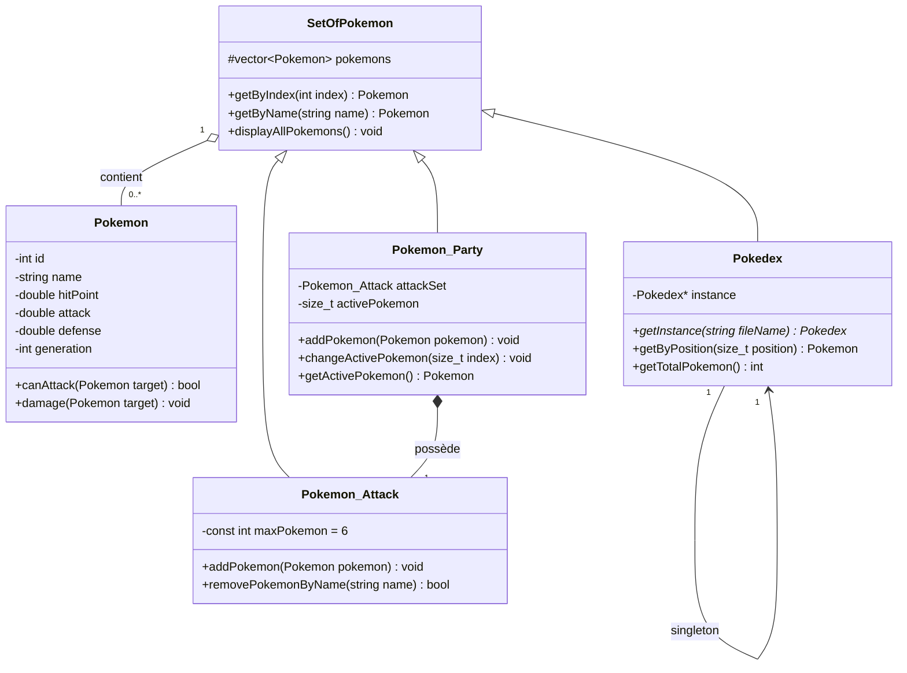
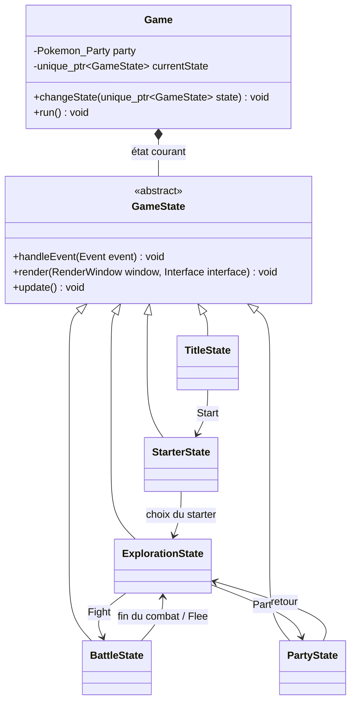
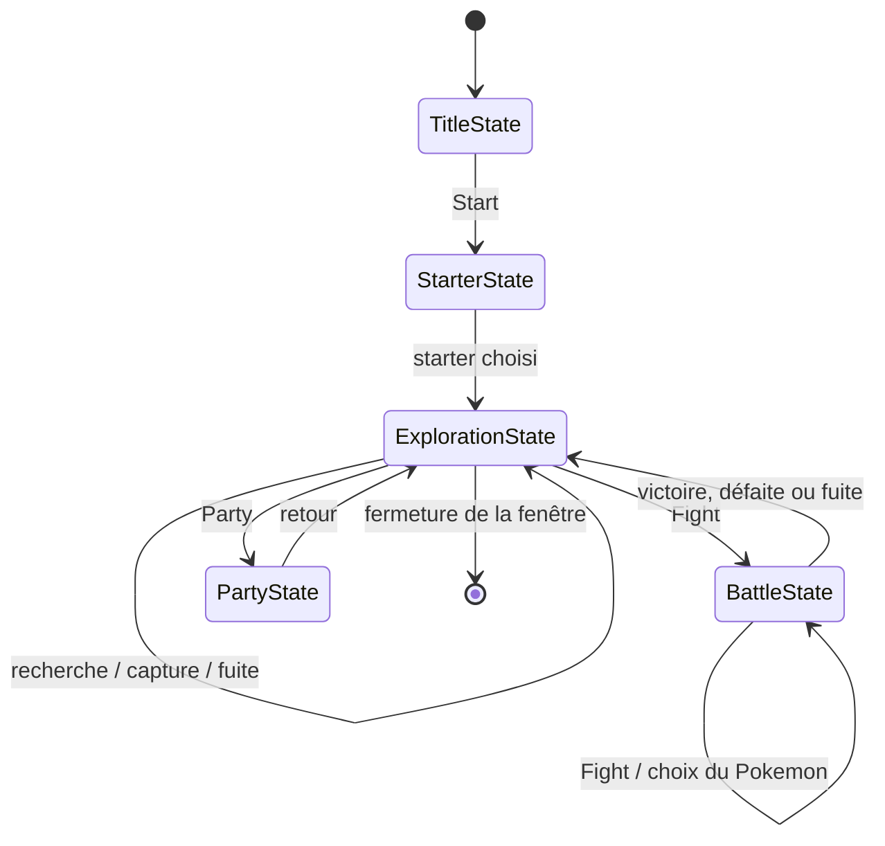

# TP Introduction en C++

Auteur : Lucas Raveloarinoro


## Introduction

Ce projet est une première introduction au langage C++. Il s'agit d'un jeu s'inspirant de Pokemon. Il a été réalisé en 18h et contient les premiers objets clés du jeu, pour une version simplifiée.

## Classes

- `Pokemon` : représente un Pokémon avec son id, son nom, ses points de vie, son attaque, sa défense et sa génération. Pour l'instant, on ne peut qu'attaquer.
- `SetOfPokemon` : classe abstraite qui stocke une collection de Pokémons et permet de les rechercher par id ou par nom.
- `Pokedex` : hérite de `SetOfPokemon`. Elle utilise le design pattern Singleton.
- `Pokemon_Party` : hérite de `SetOfPokemon` et représente l'ensemble des pokemons du joueur. Elle possède également un `Pokemon_Attack` pour les Pokémons actuellement en attaque.
- `Pokemon_Attack` : hérite de `SetOfPokemon` et représente l’ensemble des Pokémons placés en attaque, avec une limite de six Pokémons.

## Diagramme de classes



### États du jeu



### State machine




## Comment build le projet

Si vous cherchez à le build depuis le CLI, il faut être à la racine du projet, et avoir CMake et vcpkg installés. Il faut ensuite taper : 
```powershell
cmake -S . -B build `
  -DCMAKE_TOOLCHAIN_FILE="C:\path_to_vcpkg\vcpkg\scripts\buildsystems\vcpkg.cmake"```

Puis 
```cmake --build build --config Debug```

Et lancer le programme : 
```Pokemon.exe```

## Installation sous Linux

### Prérequis

Sur Debian, Ubuntu ou une distribution compatible :

```bash
sudo apt update
sudo apt install build-essential cmake libsfml-dev
```

Le projet utilise C++20 et SFML. Si la version SFML fournie par la distribution
n'est pas compatible, installer vcpkg :

```bash
git clone https://github.com/microsoft/vcpkg.git
./vcpkg/bootstrap-vcpkg.sh
```

### Compilation et installation

Depuis la racine du projet :

```bash
cmake -S . -B build-linux -DCMAKE_BUILD_TYPE=Release
cmake --build build-linux -j
cmake --install build-linux --prefix "$HOME/.local"
```

L'exécutable installé se trouve dans `~/.local/bin/Pokemon` et les ressources
dans `~/.local/bin/Ressources`. Pour l'exécuter :

```bash
cd "$HOME/.local/bin"
./Pokemon
```

Avec vcpkg, utiliser cette configuration :

```bash
cmake -S . -B build-linux \
  -DCMAKE_BUILD_TYPE=Release \
  -DCMAKE_TOOLCHAIN_FILE="$HOME/vcpkg/scripts/buildsystems/vcpkg.cmake"
```

## Installation sous macOS

### Prérequis

Installer les outils de compilation Apple et Homebrew :

```bash
xcode-select --install
/bin/bash -c "$(curl -fsSL https://raw.githubusercontent.com/Homebrew/install/HEAD/install.sh)"
brew install cmake sfml
```

Le projet utilise C++20. Depuis la racine du projet, configurer CMake en
indiquant le chemin d'installation de SFML fourni par Homebrew :

```bash
cmake -S . -B build-macos \
  -DCMAKE_BUILD_TYPE=Release \
  -DCMAKE_PREFIX_PATH="$(brew --prefix sfml)"
cmake --build build-macos -j
```

L'exécutable se trouve dans `build-macos/Pokemon`. Pour lancer le jeu :

```bash
./build-macos/Pokemon
```

Si SFML est installé avec vcpkg, remplacer la configuration précédente par :

```bash
cmake -S . -B build-macos \
  -DCMAKE_BUILD_TYPE=Release \
  -DCMAKE_TOOLCHAIN_FILE="$HOME/vcpkg/scripts/buildsystems/vcpkg.cmake"
cmake --build build-macos -j
./build-macos/Pokemon
```
